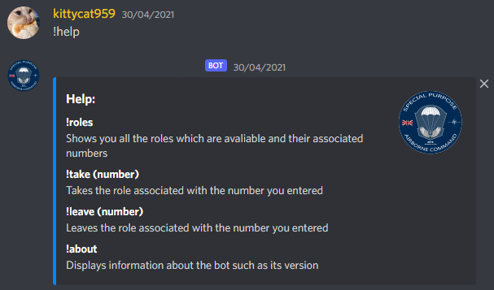
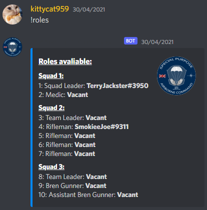
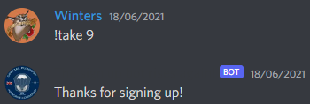
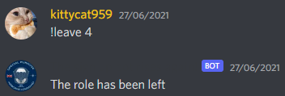
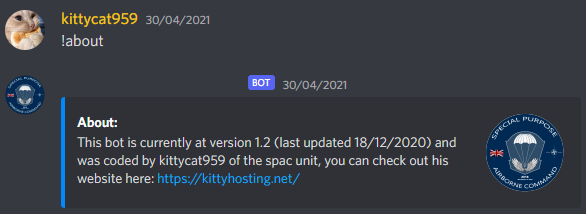

# Sign up bot
A bot I created to allow arma players to sign up to an event using the google sheets api and discord.py

## Commands:
### !help
Shows what commands are avaliable

### !roles
Shows you all the roles which are avaliable and their associated numbers

### !take (number)
Takes the role associated with the number you entered

### !leave (number)
Leaves the role associated with the number you entered

### !about
Displays information about the bot such as its version

## Setting up
To use the bot you will need:
- An api token for google sheets in the file google_token.json
- A discord bot token in the file token.txt
- Pyhton 3 installed with the packages gspread and discord.py

After this simply run the sign_up_bot.py file and invite the bot to your server